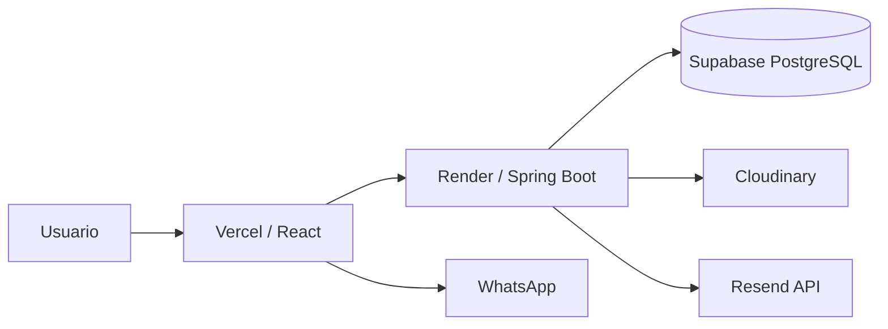

# Hajuvi

Tienda web para catálogo de productos de belleza, cuentas de cliente, favoritos, carrito y pedido por WhatsApp.

Estado actual: versión funcional desplegada con frontend en Vercel, backend en Render, PostgreSQL en Supabase, correos por Resend API e imágenes en Cloudinary.

## URLs de producción

```text
Frontend: https://hajuvi.com
Frontend www: https://www.hajuvi.com
Backend API: https://api.hajuvi.com
Frontend temporal: https://hajuvi.vercel.app
```

`www.hajuvi.com` debe redirigir al dominio canónico `hajuvi.com`.

## Stack

```text
Frontend: Vite, React, TypeScript, React Router, CSS global
Backend: Java 17, Spring Boot 3.5.x, Spring Security, JWT, Spring Data JPA, Flyway
Base de datos: PostgreSQL / Supabase
Imágenes: Cloudinary
Email transaccional: Resend API
Deploy: Vercel + Render + Cloudflare DNS
```

## Arquitectura



## Estructura del repositorio

```text
backend/        API REST Spring Boot
frontend/       Aplicación web Vite + React
Doc/            Documentación histórica y recursos de diseño locales
scripts_sql/    Scripts auxiliares locales
```

Los archivos `.env`, `.env.local`, `node_modules`, `dist`, `target` y `.git` no deben compartirse ni subirse como artefactos.

## Funcionalidad implementada

### Cliente público

```text
- Catálogo de productos activos.
- Filtro por categoría.
- Detalle de producto por slug.
- Registro de cliente.
- Verificación de email.
- Login de cliente con JWT.
- Recuperación y cambio de contraseña.
- Perfil de cliente.
- Favoritos.
- Carrito.
- Generación de pedido por WhatsApp.
```

### Administración backend

```text
- Login admin con JWT.
- Protección de /api/admin/** con rol ADMIN.
- CRUD básico de categorías.
- Crear y editar productos.
- Activar/desactivar productos.
- Agregar imágenes por URL.
- Subir imágenes a Cloudinary.
- Eliminar imágenes en PostgreSQL y Cloudinary.
- Marcar imagen principal.
- Gestión básica de usuarios admin.
- Auditoría básica de acciones administrativas sobre productos.
```

Pendiente principal: frontend de administración.

## Ejecución local

### Backend

```bash
cd backend
copy .env.example .env.local
```

Ajustar `backend/.env.local` con credenciales locales. Luego levantar PostgreSQL:

```bash
docker compose up -d
```

Ejecutar en Windows:

```powershell
.\scripts\run-local.ps1
```

O ejecutar manualmente, asegurando que las variables de entorno estén cargadas:

```bash
./mvnw spring-boot:run
```

Base URL local:

```text
http://localhost:8080
```

### Frontend

```bash
cd frontend
copy .env.example .env
npm install
npm run dev
```

Base URL local:

```text
http://localhost:5173
```

## Variables principales

Backend: ver `backend/.env.example`.

Frontend: ver `frontend/.env.example`.

Reglas importantes:

```text
- Nunca poner JWT_SECRET, DB_PASSWORD, CLOUDINARY_API_SECRET, RESEND_API_KEY ni credenciales en frontend.
- Las variables públicas de Vite deben empezar por VITE_ y no son secretas.
- En producción, CUSTOMER_EMAIL_VERIFICATION_URL y CUSTOMER_PASSWORD_RESET_URL deben apuntar a https://hajuvi.com.
- En producción, EMAIL_PROVIDER debe ser resend-api.
```

## Endpoints principales

### Públicos

```http
GET  /api/categories
GET  /api/products
GET  /api/products?category={categorySlug}
GET  /api/products/{slug}
POST /api/auth/customers/register
POST /api/auth/customers/login
POST /api/auth/customers/verify-email
POST /api/auth/customers/resend-verification
POST /api/auth/customers/forgot-password
POST /api/auth/customers/reset-password
POST /api/auth/login
```

### Cliente autenticado

```http
GET    /api/me
PATCH  /api/me/password
GET    /api/me/favorites
POST   /api/me/favorites/{productId}
DELETE /api/me/favorites/{productId}
GET    /api/me/cart
POST   /api/me/cart/items
PATCH  /api/me/cart/items/{itemId}
DELETE /api/me/cart/items/{itemId}
DELETE /api/me/cart
POST   /api/me/cart/whatsapp-order
```

### Admin autenticado

```http
GET    /api/admin/users
POST   /api/admin/users
PATCH  /api/admin/users/{id}/activate
PATCH  /api/admin/users/{id}/deactivate
GET    /api/admin/categories
POST   /api/admin/categories
PUT    /api/admin/categories/{id}
DELETE /api/admin/categories/{id}
POST   /api/admin/products
PUT    /api/admin/products/{id}
PATCH  /api/admin/products/{id}/activate
PATCH  /api/admin/products/{id}/deactivate
POST   /api/admin/products/{id}/images
POST   /api/admin/products/{id}/images/upload
PATCH  /api/admin/products/{id}/images/{imageId}/main
DELETE /api/admin/products/{id}/images/{imageId}
```

## Validación mínima antes de cambios grandes

```text
1. GET https://api.hajuvi.com/api/products responde 200.
2. Registro de cliente crea cuenta y envía email.
3. Link de verificación abre https://hajuvi.com/verify-email?token=...
4. Login cliente funciona.
5. /me, favoritos y carrito funcionan con JWT de cliente.
6. Pedido por WhatsApp genera URL válida.
7. Recuperación de contraseña envía email y permite reset.
8. Login admin devuelve JWT con rol ADMIN.
9. Endpoint /api/admin/** rechaza cliente sin token y token CUSTOMER.
```

## Notas operativas

```text
- Render Free puede dormir el backend; la primera petición puede tardar.
- Render Free no es buena base para SMTP; por eso producción usa Resend API por HTTPS.
- Vercel necesita frontend/vercel.json para servir rutas internas de React Router.
- CORS en backend debe listar exactamente los orígenes del frontend.
- El primer admin puede requerir bootstrap SQL con password BCrypt.
```

## Próxima etapa

Construir panel de administración en frontend:

```text
/admin/login
/admin
/admin/products
/admin/products/new
/admin/products/:id/edit
/admin/categories
/admin/users
```
